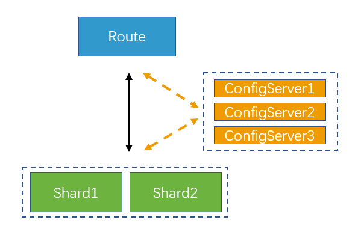

* [官网](https://docs.mongodb.com/manual/tutorial/)
* [安装](https://docs.mongodb.com/manual/tutorial/install-mongodb-on-red-hat/)
# 给数据库test添加用户
```sh
use test
db.createUser({user:"codesafe",pwd:"codesafe",roles:[{role:"readWrite",db:"test"}]})
```

# 带有访问控制启动
```sh
mongod --auth --dbpath /data/db1 --logpath /data/log/db1.log --fork
```

# 配置复制集
## 新建复制集
```sh
mongod --dbpath /data/set1 --logpath /data/log/set1.log --replSet repset --fork --port 27101
mongod --dbpath /data/set2 --logpath /data/log/set2.log --replSet repset --fork --port 27102
```
## 初始化复制集
```sh
mongod --port 27101
config={
    _id: "repset",members: [
        {_id: 0,host: "127.0.0.1:27101"},
        {_id: 1,host: "127.0.0.1:27102"}
    ]
}
rs.initiate(config)
```
* rs.status() - 查看状态
* rs.conf() - 查看配置
* rs.slaveOk() - 设置允许从SECONDARY读数据

# 配置分片
   
Shard1: 
```sh
mongod --port 27101 --dbpath /data/db1 --logpath /data/log/db1.log --shardsvr --fork
```
Shard2: 
```sh
mongod --port 27102 --dbpath /data/db2 --logpath /data/log/db2.log --shardsvr --fork
```
ConfigServer1: 
```sh
mongod --port 27103 --dbpath /data/c1 --logpath /data/c1.log --configsvr --replSet repset --fork
```
ConfigServer2: 
```sh
mongod --port 27104 --dbpath /data/c2 --logpath /data/c2.log --configsvr --replSet repset --fork
```
ConfigServer3: 
```sh
mongod --port 27105 --dbpath /data/c3 --logpath /data/c3.log --configsvr --replSet repset --fork
```
初始化复制集
```sh
mongo --port 27103
config={
    _id: "repset",members: [
        {_id: 0,host: "127.0.0.1:27103"},
        {_id: 1,host: "127.0.0.1:27104"},
        {_id: 2,host: "127.0.0.1:27105"}
    ]
}
rs.initiate(config)
```
Router:
```sh
mongos --configdb repset/127.0.0.1:27103,127.0.0.1:27104,127.0.0.1:27105 --logpath /data/route.log --port 40000 --fork
```
配置分片算法，分片key，并启用分片设置
```sh
mongo --port 40000 
sh.addShard("127.0.0.1:27101")
sh.addShard("127.0.0.1:27102")
sh.enableSharding('test')
sh.shardCollection('test.user',{'_id':'hashed'}) or sh.shardCollection('test.user',{'_id':1})
```
# GridFS
* db.fs.files.find() - 查看元数据
* db.fs.chunks.find() - 查看具体文件数据
* sh.shardCollection('test.fs.chunks',{'files_id':'hashed'}) - 添加分片键
# 注意事项
* 当分片不在一台机器上时，以上所有配置都不能使用localhost
# 数据备份与恢复
## 数据备份
mongodump -h 127.0.0.1:40000 -d test -o /data/dump
## 数据恢复
mongorestore -h 127.0.0.1:40000 -d test -o /data/dump/test
# 常用命令
* use admin - 使用admin权限
* db.COLLECTION_NAME.remove({}) - 删除集合数据
* mongod --storageEngine wiredTiger - 使用wiredTiger存储引擎
* show dbs - 查看数据库列表
* db.dropDatabase() - drop数据库
* db.runCommand({addShard:"ip:port"}) - 添加分片,需要先输入use admin
* db.adminCommand({movePrimary:"shard0003",to:"shard0001"}) - 移动分片
* db.adminCommand({removeShard:"分片名"}) - 删除分片，删除前必须执行上面步骤
* sh.addShard("shardSet1/127.0.0.1:27101") - 添加一个分片，该分片是复制集shardSet1的一部分
* db.runCommand({listshards: 1}) - 查询分片列表